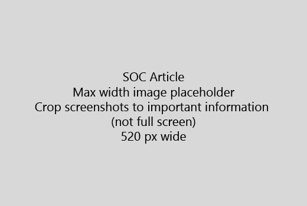

Starta din artikel med en mycket kort introduktion (1 meningen). Placera dig själv i läsarens plats - Varför är de här? Vad gör de?Start your article with a very short introduction (1 sentence). Put yourself in the reader's place - why are they here? What should they do? 
  
1. Få direkt till en kort lista över åtgärder för att slutföra aktiviteten.Get straight to a quick list of steps to accomplish the task.
    
    Om du måste förklara koncept eller de behöver bestämda steg, lägger du till en snabb Sammanfattning under steget där de behöver och [länk](https://support.office.com/article/f37e7984-cf03-4fde-92d3-82970d7e241b.aspx) till koncept eller steg.If you need to explain a concept, or they have to do pre-requisite steps, add a quick summary below the step where they need it, and [link](https://support.office.com/article/f37e7984-cf03-4fde-92d3-82970d7e241b.aspx) to the concept or steps. 
    
2. Behåll förfaranden kort - helst 5 eller färre steg, mer än 8.Keep procedures short - preferably 5 or fewer steps, no more than 8.
    
3. Använda **användargränssnittet** för element i användargränssnittet eller användarna behöver skriva text.Use **Ui style** for user interface elements or for text people need to enter. 
    
4. Använd verb väljer, eller ange som åtgärder och välj Formatera menyer som **menyn** \> **kommando**.Use the verbs choose, select, or enter as actions, and format menus as **Menu** \> **Command**.
    
5. Lägg eventuellt en skärmbild för kontexten (om Användargränssnittet är svårt att hitta eller det behövs för att slutföra aktiviteten).Optionally, add a screenshot for context (if UI is hard to locate, or it's needed to complete the task).
    
    Maximal bredd: 520 pixlar. Använda ett tema som standard, inte visa någon personlig information och beskära så att endast det som är relevant.Maximum width: 520 pixels. Use a standard theme, do not show any personal information, and crop to show only what's relevant. 
    
    
  
Om du vill lägga till en video eller en skärmbild, använda ett rutnät med två kolumner och stegen i vänster och video eller skärmbild i höger - Se [video rutnät exempel och steg](https://support.office.com/article/14ce8e82-efa0-47f5-bb84-94f078db3dae.aspx).If you want to add a video or screenshot, use a two-column grid and have the steps in the left and the video or screenshot in the right - see [Steps and video grid example](https://support.office.com/article/14ce8e82-efa0-47f5-bb84-94f078db3dae.aspx). 
  
Mer än 500 ord för en artikel som mål.Target no more than 500 words for an article.
  
# Exempel-artikelExample article

[Ändra min fotoChange my photo](https://support.office.com/article/555376e0-1fca-49ba-8434-307a0525c767.aspx)
  

