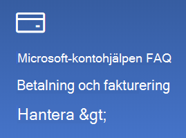

# Ändra informationen på mitt Microsoft-kontoChange my Microsoft account information

Gå till [https://account.microsoft.com](https://account.microsoft.com/) och logga in om det behövs.Go to [https://account.microsoft.com](https://account.microsoft.com/) and sign in if necessary. Då kommer du till instrumentpanelen för ditt konto.This will take you to your account dashboard.  

**Redigera mitt namn och personlig uppgifter****Edit my name and personal information**

1. Klicka på de tre punkterna (fler åtgärder) bredvid kontobilden och ditt kontonamn på instrumentpanelen för ditt konto > Redigera profil\*\*.On your account dashboard, next to your account picture and name, click the three dots (more actions) > Edit profile\*\*.
2. Använd länkarna på sidan **Redigera profil** för att ändra profilbild, namn, födelsedatum, plats och inställningar för visningsspråk.On the **Edit profile** page, use the links provided to change your profile picture, name, date of birth, location, and display language preference. Observera länkarna till dina Xbox- eller Skype-kontoprofiler, där du kan ändra informationen för dessa konton.Note the links to your Xbox or Skype account profiles, where you can change details specific to these accounts.

**Hantera e-postadresser och telefonnummer****Manage e-mail addresses and phone numbers**

Ett Microsoft-konto har en eller flera e-postadresser eller telefonnummer kopplade till dess "alias".A Microsoft account has one or more e-mail addresses or phone numbers associated with it as “aliases.” För att hantera dessa:To manage these:

1. På instrumentpanelen för ditt konto, bredvid kontobilden och namnet, klickar du på de tre punkterna (fler åtgärder) > **Redigera profil**.On your account dashboard, next to your account picture and name, click the three dots (more actions) > **Edit profile**.
2. På sidan **Redigera profil** klickar du på **Hantera hur du loggar in på Microsoft**.On the **Edit profile** page, click **Manage how you sign in to Microsoft**. 
3. En lista med kontoalias visas. Du kan hantera listan och lägga till eller ta bort e-postadresser och telefonnummer.You will see a list of account aliases, and you can manage the list, including adding and deleting e-mail addresses and phone numbers. Här kan du också välja vilka alias som kan användas för att logga in på kontot och vilka alias som är "primära". Dessa visas på dina Windows 10-enheter.Here you can also select which aliases can be used to sign in to the account, and which alias is considered “primary,” which will be displayed on your Windows 10 devices.

**Hantera betalningssätt, samt namn och adress för fakturering****Manage payment methods, as well as name and address for billing** 

1. På instrumentpanelen för ditt konto, bredvid kontobilden och namnet, klickar du på de tre punkterna (fler åtgärder) > **Redigera profil**.On your account dashboard, next to your account picture and name, click the three dots (more actions) > **Edit profile**.
2. Under **Betalning och fakturering** klickar du på **Hantera**.Under **Payment & billing** click **Manage**.

    

3. Här kan du lägga till, ändra och ta bort betalningssätt och deras kopplade faktureringsadresser.Here you can add, edit, and remove payment methods and their associated billing addresses. 
