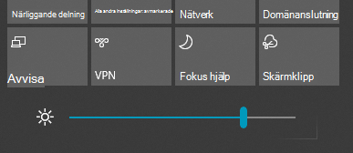

# Ändra skärmens ljusstyrka i Windows 10Change screen brightness in Windows 10

Om din Windows 10 är nyare än version 1903 finns skjutreglaget **Ljusstyrka** i åtgärdscentret.If your Windows 10 is newer than version 1903, it has a **Brightness slider** in the action center. Öppna åtgärdscentret genom att klicka på knappen **Aviseringar** till höger i aktivitetsfältet eller trycka på knappen **Windows hem + A** på tangentbordet.To open the action center, click the **Notification** button at the rightmost side of your taskbar, or press **Windows home + A** on your keyboard.

Om din Windows 10 är en tidigare version hittar du skjutreglaget för ljusstyrka genom att gå till **[Inställningar > System > Skärm](ms-settings:display?activationSource=GetHelp)**.If your Windows 10 is an earlier version, you can find the brightness slider by going to **[Settings > System > Display](ms-settings:display?activationSource=GetHelp)**.

**Anmärkningar**:**Notes**:

- Du kanske inte ser Ändra ljusstyrkan för det inbyggda visningsreglaget på stationära datorer som har en extern bildskärm.You might not see the Change brightness for the built-in display slider on desktop PCs that have an external monitor. Om du vill ändra ljusstyrkan på en extern bildskärm använder du kontrollerna som finns på skärmen.To change the brightness of an external monitor, use the controls on the monitor.
- Om du inte har en stationär dator och skjutreglaget inte visas eller fungerar kan du prova att uppdatera bildskärmens drivrutin.If you don't have a desktop PC and the slider doesn't appear or work, try updating the display driver. Välj sökrutan i aktivitetsfältet, skriv **enhetshanteraren** och välj sedan **Enhetshanteraren** i resultatlistan.In the search box on the taskbar, type **Device Manager**, and then select **Device Manager** from the list of results. Välj **Bildskärmskort** i **Enhetshanteraren** och välj sedan bildskärmsadaptern.In **Device Manager**, select **Display adapters**, then select the display adapter. Tryck och håll ned (eller högerklicka) på bildskärmsadapterns namn och klicka på **Uppdatera drivrutin**. Följ sedan instruktionerna.Press and hold (or right-click) the display adapter name and click **Update driver**; then follow the instructions.
