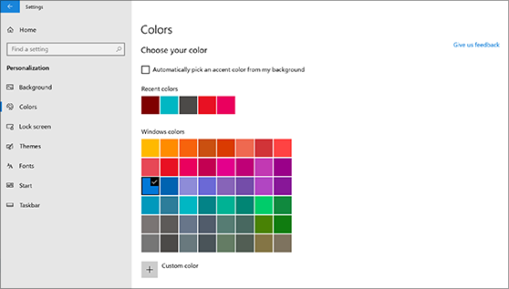
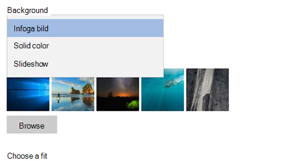

# Ändra Skriv bords bakgrund och färgerChange your desktop background and colors

Om du vill ändra inställningarna för färger går du till **Start**  >  **Inställningar**  >  **Anpassa**  >  **färger**och väljer sedan en egen färg eller låter Windows dra en accentfärg från bakgrunden.To change your colors setting, go to **Start** > **Settings** > **Personalization** > **Colors**, and then choose your own color or let Windows pull an accent color from your background.

Om du vill ändra Skriv bords bakgrund går du till **Start**  >  **Inställningar**  >  **Anpassa**  >  **bakgrund**och väljer sedan en bild, solid färg eller skapar ett bild spel.To change your desktop background, go to **Start** > **Settings** > **Personalization** > **Background**, and then choose a picture, solid color, or create a slideshow of pictures. 

Vill du ha fler bakgrunder och färger?Want more desktop backgrounds and colors? Gå till [Microsoft Store](https://www.microsoft.com/store/collections/windowsthemes) och välj bland dussin tals gratis teman.Visit [Microsoft Store](https://www.microsoft.com/store/collections/windowsthemes) to choose from dozens of free themes.
