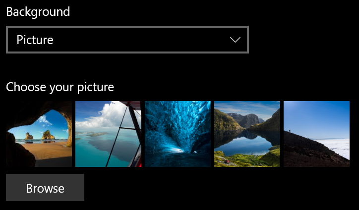
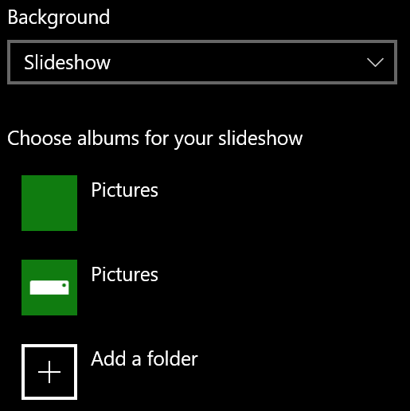

# Ändra lås skärmens bakgrund

- Gå till fönstret **Inställningar**för  >  **anpassnings**  >  **Lås**. Eller klicka eller tryck [här](ms-settings:lockscreen?activationSource=GetHelp).

- Om du vill ange en anpassad bakgrunds bild väljer du **bild** i list rutan **bakgrund** och väljer eller **bläddrar** till bilden.

  

- Om du vill konfigurera ett bild spel med anpassade bilder väljer du **bild spel** i list rutan **bakgrund** och väljer ett album eller lägger till en mapp som innehåller bilderna för bild spelet.

  
