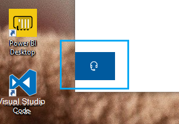

# Kontakta oss genom att klicka på hörlursknappenContact us by clicking the headphone button

Om du vill kontakta Microsoft Support klickar du på **Kontakta oss** i det nedre vänstra hörnet av den här appen.If you'd like to contact Microsoft Support, please click **Contact us** in the lower left corner of this app. Inne i utfällbara fönstret kommer du att styras till rätt stödkanal efter att ha valt din produkt- och utgivningskategori.Inside the fly-out window, you will be guided to the right support channel after choosing your product and issue category.

Du kan fortsätta interagera med resten av appen även efter att du har initierat en Kontakta oss-session.You can keep interacting with the rest of the app even after you have initiated a Contact us session. Panelen Kontakta oss kan tillfälligt minimeras genom att klicka någon annanstans i appen.The Contact us panel can be temporarily minimized by clicking anywhere else inside the app. Om du vill återgå till samma session klickar du bara på **Kontakta oss** igen.To return to the same session, just click **Contact us** again.
