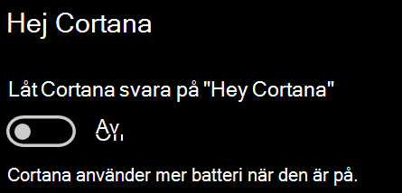

# Cortana pratar inte med mig eller kan inte höra migCortana doesn’t talk to me or can’t hear me

Om du försöker använda funktionen "Hey Cortana", som gör att du kan prata med Cortana utan att välja Cortana-knappen i Aktivitetsfältet eller mikrofonknappen på Cortana-panelen, bekräftar du att funktionen är aktiverad:If you are trying to use the "Hey Cortana" feature, which allows you to talk to Cortana without selecting the Cortana button on the taskbar or the microphone button in the Cortana panel, confirm that the feature is enabled:

1. Gå till **Start**och välj sedan **[Inställningar > Cortana](ms-settings:cortana?activationSource=GetHelp)**.Go to **Start**, then select **[Settings > Cortana](ms-settings:cortana?activationSource=GetHelp)**.
2. Under **Hey Cortana**växlar du **växlingen med Låt Cortana svara på "Hey Cortana"** till **På**.Under **Hey Cortana**, switch the **Let Cortana respond to "Hey Cortana"** toggle to **On**.

**Hindrar dina sekretessinställningar Cortana från att höra dig?****Are your privacy settings preventing Cortana from hearing you?**

Dina sekretessinställningar kan hindra Cortana från att svara på din röst.Your privacy settings can prevent Cortana from responding to your voice.
- Kontrollera att taligenkänning online är aktiverat:Check to make sure Online Speech recognition is turned on:
    - Gå till **Start**och klicka sedan på **[Inställningar > Sekretess > Tal](ms-settings:privacy-speech?activationSource=GetHelp)**.Go to **Start**, then click **[Settings > Privacy > Speech](ms-settings:privacy-speech?activationSource=GetHelp)**.
    - Växla inställningen till **På**under **Taligenkänning online**.Under **Online speech recognition**, switch the setting to **On**.
- Kontrollera att Cortana har behörighet att komma åt mikrofonen.Check to make sure Cortana has permission to access your microphone. 
    - Gå till Start och klicka sedan på **[Inställningar > Sekretess > mikrofon](ms-settings:privacy-microphone?activationSource=GetHelp)**.Go to Start, then click **[Settings > Privacy > Microphone](ms-settings:privacy-microphone?activationSource=GetHelp)**.
    - Under **Välj vilka appar som kan komma åt din mikrofon**letar du efter **Cortana** i listan över appar och tjänster och ser till att växeln växlas till **På**.Under **Choose which apps can access your microphone**, look for **Cortana** within the list of apps and services and make sure the switch is toggled to **On**.

Dessutom, se också till att dina högtalare eller mikrofoner är upp och arbetar för att prata med Cortana.Moreover, please also make sure that your speakers or microphones are up and working in order to talk to Cortana.
