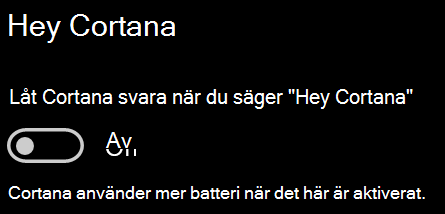

# Cortana pratar inte med mig eller kan inte höra mig

Om du försöker använda funktionen "Hey Cortana", som gör att du kan prata med Cortana utan att välja Cortana-knappen i Aktivitetsfältet eller mikrofonknappen på Cortana-panelen, bekräftar du att funktionen är aktiverad:

1. Gå till **Start**och välj sedan **[Inställningar > Cortana](ms-settings:cortana?activationSource=GetHelp)**.
2. Under **Hey Cortana**växlar du **växlingen med Låt Cortana svara på "Hey Cortana"** till **På**.

**Hindrar dina sekretessinställningar Cortana från att höra dig?**

Dina sekretessinställningar kan hindra Cortana från att svara på din röst.
- Kontrollera att taligenkänning online är aktiverat:
    - Gå till **Start**och klicka sedan på **[Inställningar > Sekretess > Tal](ms-settings:privacy-speech?activationSource=GetHelp)**.
    - Växla inställningen till **På**under **Taligenkänning online**.
- Kontrollera att Cortana har behörighet att komma åt mikrofonen. 
    - Gå till Start och klicka sedan på **[Inställningar > Sekretess > mikrofon](ms-settings:privacy-microphone?activationSource=GetHelp)**.
    - Under **Välj vilka appar som kan komma åt din mikrofon**letar du efter **Cortana** i listan över appar och tjänster och ser till att växeln växlas till **På**.

Dessutom, se också till att dina högtalare eller mikrofoner är upp och arbetar för att prata med Cortana.
