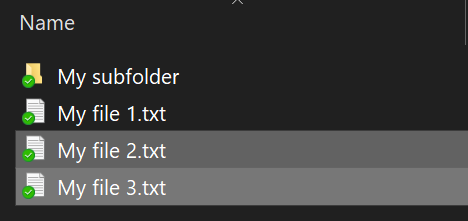
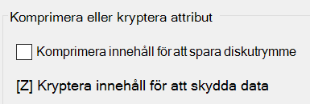

# Kryptera filer eller mappar i Windows 10

Du kan kryptera en hel disk med BitLocker, men bara kryptera enskilda filer eller mappar (och deras innehåll):

1. Välj **den** fil/de filer/mappar du vill kryptera i Utforskaren. I det här exemplet har två filer markerats:

    

2. Högerklicka på de markerade filerna och klicka på **Egenskaper.**

3. Klicka på **Avancerat** i fönstret **Egenskaper.**

4. I fönstret **Avancerade egenskaper** markerar du kryssrutan Kryptera innehåll för att **skydda data:**

    

5. Klicka på **OK**.
