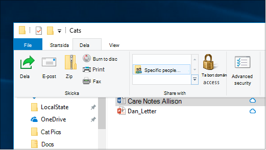
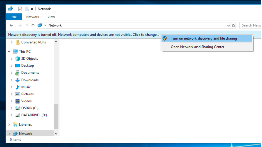

# Fildelning över ett nätverk i Windows 10

**Obs!** Om du tidigare använde Hemgrupp för fildelning bör du observera att Hemgrupp har tagits bort från Windows 10 (version 1803). Nu kan du dela skrivare och filer med hjälp av inbyggda funktioner i Windows 10.

**Dela filer eller mappar i ett nätverk**

- Välj **en fil** i Utforskaren >  klicka på fliken Dela högst >  i avsnittet Dela med och klicka på **Specifika personer.**

    
          
- Om du markerar flera filer på samma gång kan du dela dem alla på samma sätt. Det fungerar även för mappar.

**Så här visar du enheter i nätverket som delar filer**

- Gå **till Nätverk** i **Utforskaren.** Om nätverksidentifieringen inte har aktiverats visas felmeddelandet "Nätverksidentifieringen är inaktiverad..."

- Klicka på **banderollen Nätverksidentifiering är inaktiverad** och klicka **sedan på Aktivera nätverksidentifiering och fildelning.**

    

[Läs mer om fildelning över ett nätverk](https://support.microsoft.com/help/4092694/windows-10-file-sharing-over-a-network)

[Dela filer med hjälp av appar, OneDrive, e-postmeddelanden med mera](https://support.microsoft.com/help/4027674/windows-10-share-files-in-file-explorer)
