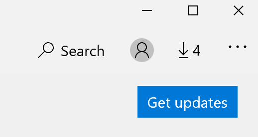

# Åtgärda visningsspråket för apparFix the display language of apps

När du har ändrat visningsspråket i Windows 10 kan vissa appar fortfarande använda föregående språk när du öppnar dem.After you change the display language in Windows 10, some apps may still use the previous language when you open them. Detta beror på att nya versioner av apparna för det språket måste hämtas från Store.This happens because new versions of the apps for that language must be downloaded from the Store. Åtgärda problemet genom att vänta på den automatiska uppdateringen eller installera den uppdaterade versionen av apparna manuellt.To fix this problem, you can either wait for the automatic update, or you can manually install the updated version of the apps.

Om du vill installera uppdateringen manuellt öppnar du **Microsoft Store** och klickar på Nedladdningar **och uppdateringar** i det övre högra hörnet.To manually install the update, open **Microsoft Store** and click **Downloads and updates** in the top right corner. Klicka sedan på **Hämta uppdateringar**.Then click **Get updates**. Om språket inte ändras när uppdateringen är klar kan du prova att starta om datorn.If the language is not changed after the update is complete, try restarting your PC.

Mer information om inställningar för inmatning och visning finns i [Hantera inmatnings- och visningsspråkinställningarna i Windows 10](https://support.microsoft.com/help/4027670/windows-10-add-and-switch-input-and-display-language-preferences).To read more about input and display language settings, see [Manage your input and display language settings in Windows 10](https://support.microsoft.com/help/4027670/windows-10-add-and-switch-input-and-display-language-preferences).
