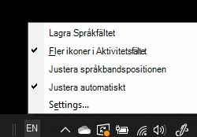

# Dölja, visa eller återställa språkfältetHide, display, or reset the language bar

**Så här minimerar du språkfältet:****To minimize the language bar:**

Du kan klicka på knappen Minimera i det övre högra hörnet i språkfältet.You can click the minimize button on the top right corner of the language bar. Du kan också dra språkfältet till aktivitetsfältet, vilket automatiskt minimerar det.Or, you can just drag the language bar to the task bar, which will automatically minimize it.

**Så här tar du fram språkfältet:****To pop out the language bar:**

Om du inte vill docka språkfältet i Aktivitetsfältet högerklickar du på ett tomt utrymme  i Aktivitetsfältet och avmarkerar alternativet Språkfältet på menyn Verktygsfält.If you don't want to dock the language bar in the taskbar, right-click any empty space in the taskbar, and uncheck the **Language bar** option in the Toolbars menu. Språkfältet visas då utanför Aktivitetsfältet, precis som i föregående skärmbild.This will make the language bar appear outside the taskbar, just like the previous screenshot.

**Så här återställer du språkfältet till standardinställning:****To restore the language bar to default:**

Högerklicka på språkknappen i verktygsfältet och klicka på **Återställ språkfältet** på menyn.Right-click the language button in the toolbar, and click **Restore the language bar** option in the menu. Då återställs den till standardinställningarna.This will restore it to default.

