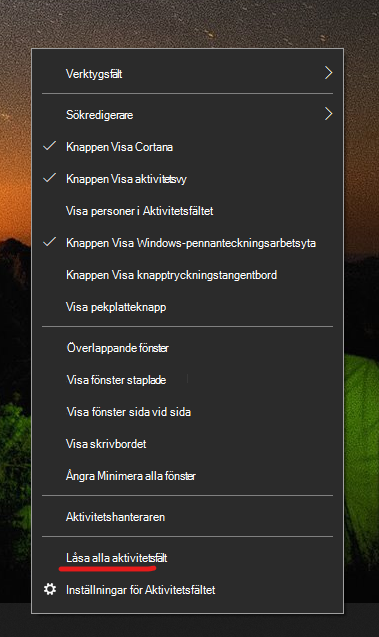

# Flytta aktivitetsfältet till någon sida eller till längst upp på skrivbordet

Bekräfta först att aktivitetsfältet inte är låst. Om du vill ta reda på om aktivitetsfältet är olåst högerklickar du på ett tomt utrymme i aktivitetsfältet och ser om **Lås aktivitetsfältet** har en bockmarkering bredvid sig. Om det finns en bockmarkering är aktivitetsfältet låst och kan inte flyttas. Klicka en gång på **Lås aktivitetsfältet** så låser du upp det och tar bort bockmarkeringen.

Om du har flera bildskärmar som visar aktivitetsfältet visas **Lås alla aktivitetsfält**.

När aktivitetsfältet har låsts upp kan du klicka och hålla ned på ett tomt utrymme i aktivitetsfältet och dra det till den plats du vill på skärmen. Det kan du också göra genom att högerklicka på ett tomt utrymme i aktivitetsfältet och gå till **[Inställningar för aktivitetsfältet](ms-settings:taskbar?activationSource=GetHelp) > Aktivitetsfältets plats på skärmen**.
