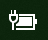
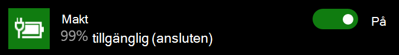

# Ikonen för ström eller batteriet saknas i Windows 10Power or battery icon missing in Windows 10

Om din Windows 10-enhet har ett batteri (t.ex. en bärbar dator, surfplatta eller en dator ansluten via USB till en UPS) visas vanligtvis en ikon för ström eller batteri i aktivitetsfältet nära klockan, till exempel:If your Windows 10 device has a battery (e.g., laptop or tablet, or a PC connected via USB to a UPS), normally a power/battery icon is shown in the taskbar near the clock, for example:

Om den här ikonen inte visas kan den vara dold:If you don't see this icon, it may be hidden:

1. Gå till **[Inställningar > Anpassning > Aktivitetsfältet](ms-settings:taskbar?activationSource=GetHelp)**.Go to **[Settings > Personalization > Taskbar](ms-settings:taskbar?activationSource=GetHelp)**.

2. I meddelandefältet klickar du på **Välj vilka ikoner som ska visas i Aktivitetsfältet**.In the Notification area, click **Select which icons appear on the taskbar**.

3. Leta sedan efter objektet för **Ström** i listan och ändra inställningen till **På**.Then find the **Power** item in the list and toggle its setting to **On**.

    

**Felsökning****Troubleshooting**

Om du följde anvisningarna ovan och knappen för **Ström** är nedtonad eller inte visas går du till sökrutan i Aktivitetsfältet och skriver in **Enhetshanteraren**, välj sedan **Enhetshanteraren** i resultatlistan.If you followed the above instructions and the **Power** toggle is greyed out or not visible, in the search box on the taskbar, type **device manager**, and then select **Device Manager** in the list of results. Via **Batterier** högerklickar du på enhetens batteri, klicka på **Inaktivera** och sedan på **Ja**.Under **Batteries**, right-click the battery for your device, click **Disable**, and click **Yes**. Vänta några sekunder och högerklicka sedan på batteriet och klicka på **Aktivera**.Wait a few seconds, and then right-click the battery and click **Enable**. Starta sedan om enheten.Then restart your device.

Om du följde anvisningarna ovan men ikonen för batteriet visas inte i aktivitetsfältet går du till sökrutan i Aktivitetsfältet och skriver in **Aktivitetshanteraren**, klicka sedan på **Aktivitetshanteraren** i resultatlistan.If you followed the above instructions, but the battery icon does not appear on the taskbar, in the search box on the taskbar, type **task manager**, and then click **Task Manager** in the list of results. På fliken **Processer** under **Namn** högerklickar du på **Utforskaren** och klickar sedan på **Starta om**.On the **Processes** tab, under **Name**, right-click **Explorer**, and then click **Restart**.
