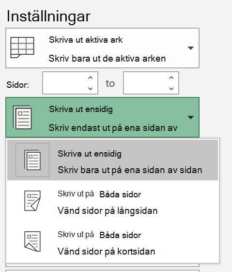
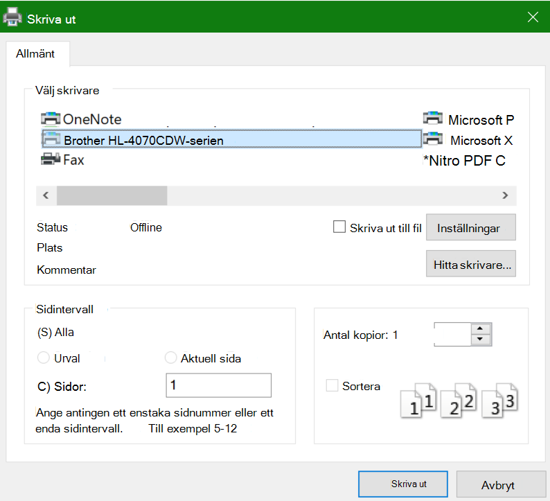

# Skriva ut på båda sidor av papperet (dubbelsidig utskrift)

**Klarar min skrivare av dubbelsidig utskrift?**

Skrivarens funktionssammanfattning eller manuella information bör tala om för dig om den klarar av att skriva ut på båda sidor av papperet, även kallat "dubbelsidig utskrift". Om du har Microsoft Office kan du också ta reda på det genom att öppna ett Office-program som Word eller Excel och gå till Arkiv **>** Skriv ut, kontrollera att rätt skrivare är vald och leta efter funktionen i avsnittet Inställningar. Till exempel: 

**Dubbelsidig utskrift i Microsoft Office**

Om skrivaren klarar att skriva ut på båda sidorna och du går till Arkiv **>** Skriv ut i Office-programmet visas ett alternativ för "Skriv ut på båda sidor" som i exemplet ovan.  Välj den typ av dubbelsidig utskrift som du vill använda (vänd längs långsidan eller vänd längs kortsidan) och klicka på Skriv ut för att starta utskriften. 

**Dubbelsidig utskrift från alla program**

I många program när du skriver ut visas en allmän dialogruta som ser ut så här: 

Kontrollera att rätt skrivare är vald och klicka sedan på **Inställningar för** att öppna fönstret med skrivarinställningar. Om skrivaren klarar dubbelsidig utskrift visas möjligheten att aktivera detta för det aktuella utskriftsjobbet i det fönstret.
