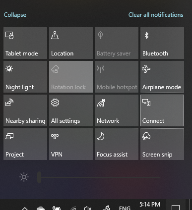

# Projicera till en datorProject to a PC

På din målenhet (projicera till) söker du efter "Projektionsinställningar" för att öppna sidan Inställningar i **Projicera på den här datorn.**On your destination device (projecting to), search for "Projection Settings" to open the Settings page of **Projecting to this PC**. Kontrollera sedan att:Then make sure that:
- "Vissa Windows- och Android-enheter kan projicera på den här datorn när du säger att det är OK" är den nedrullningade menyn inställd på **Alltid av.**"Some Windows and Android devices can project to this PC when you say it's OK" drop-down menu is set to **Always Off**.
- Listrutan "Be om att projicera till den här datorn" är inställd **på Varje gång en anslutning krävs**."Ask to project to this PC" drop-down menu is set to **Every time a connection is required**.
- Listrutan "Kräv PIN för koppling" är inställd på **Aldrig**."Require PIN for pairing" drop-down menu is set to **Never**.

Starta appen Anslut på din **målenhet** genom att gå till **Start** och söka efter "Anslut".On your destination device, launch **Connect** app by going to **Start** and search for "Connect".

På källenheten som du försöker projicera från:Then, on your source device that you are trying to project from:

1. Tryck **på Windows-tangenten + A** för att öppna Åtgärdscenter.Press **Windows key + A** to open Action Center.
2. Klicka **på Anslut**.Click **Connect**.
3. Klicka på den enhet som du vill projicera skärmen till.Click the device you want to project the screen to.

Efter stegen ovan ska målenheten visa skärmen på källenheten som om den vore en sekundär bildskärm.After the above steps, your destination device should display the screen of the source device as if it is a secondary monitor.
