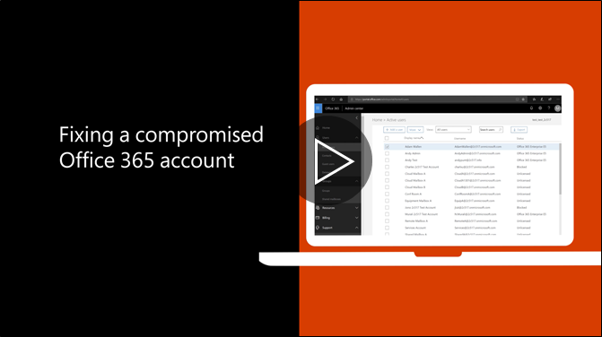

# Vad du bör göra om ett konto har komprometteratsRecommended steps to take if an account is compromised

  
1. [Återställ lösenordet](https://support.office.com/article/7a5d073b-7fae-4aa5-8f96-9ecd041aba9c) omedelbart. Kommunicera inte det nya lösenordet via e-post till användaren.[Reset the user's password](https://support.office.com/article/7a5d073b-7fae-4aa5-8f96-9ecd041aba9c) immediately. Do not communicate the new password through email to the end user. 
    
2. Ta bort alla misstänkta [vidarebefordring adresser](https://support.office.com/article/ab5eb117-0f22-4fa7-a662-3a6bdb0add74) till postlådenivå.Remove any suspicious [forwarding addresses](https://support.office.com/article/ab5eb117-0f22-4fa7-a662-3a6bdb0add74) set at the mailbox level. 
    
3. Ta bort alla misstänkta [regler för Inkorgen](https://support.office.com/article/1433E3A0-7FB0-4999-B536-50E05CB67FED) i postlådan.Remove any suspicious [inbox rules](https://support.office.com/article/1433E3A0-7FB0-4999-B536-50E05CB67FED) set within the mailbox. 
    
4. Om användaren är blockerad från att skicka e-post, [Gå till begränsade användare att låsa upp kontot](https://protection.office.com/?hash=/restrictedusers). När klar kan kunna användaren fortsätta skicka meddelanden inom 1 timme.If the user is blocked from sending email, [go to the Restricted Users to unblock the account](https://protection.office.com/?hash=/restrictedusers). Once done, the user should be able to resume sending messages within 1 hour.
    
5. Ta bort användarkontot från [grupper av administrativ roll](https://support.office.com/article/eac4d046-1afd-4f1a-85fc-8219c79e1504) tills du är säker på att kontot inte längre äventyras.Remove the user account from any [administrative role groups](https://support.office.com/article/eac4d046-1afd-4f1a-85fc-8219c79e1504) until you are confident that the account is no longer compromised. 
    
Om du vill minimera risken för brott data och eventuella skador i framtiden bör läsa vår [bästa praxis artikel för säkerheten i Office 365](https://support.office.com/article/9295e396-e53d-49b9-ae9b-0b5828cdedc3).To minimize the potential of a data breach or a compromised account in the future, we recommend reading our [Office 365 Security best practices article](https://support.office.com/article/9295e396-e53d-49b9-ae9b-0b5828cdedc3).
  

