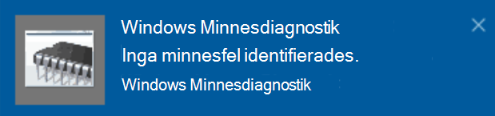

# Köra Windows Minnesdiagnostik i Windows 10

Om Windows och appar på datorn kraschar, fryser eller agerar på ett instabilt sätt kan det vara problem med datorns minne (RAM). Du kan köra Windows Memory Diagnostic för att söka efter problem med datorns RAM.You can run the Windows Memory Diagnostic to check for problems with the PC's RAM.

Skriv **minnesdiagnostik**i sökrutan i Aktivitetsfältet och välj sedan **Windows Minnesdiagnostik**. 

För att köra diagnostiken måste datorn startas om. Du har möjlighet att starta om omedelbart (spara ditt arbete och stäng öppna dokument och e-post först), eller schemalägga diagnostiken så att den körs automatiskt nästa gång datorn startas om:

När datorn startas om körs **Windows Minnesdiagnostikverktyg** automatiskt. Status och förlopp visas när diagnostiken körs, och du har möjlighet att avbryta diagnostiken genom att trycka på **ESC-tangenten** på tangentbordet.

När diagnostiken är klar startar Windows normalt.
Omedelbart efter omstarten visas ett meddelande (bredvid **åtgärdscenterikonen** i Aktivitetsfältet) när skrivbordet visas (bredvid åtgärdscenterikonen i Aktivitetsfältet) för att ange om några minnesfel hittades. Ett exempel:

Här är ikonen i Åtgärdscenter:  

Och ett exempel meddelande: 

Om du missade meddelandet kan du välja **ikonen Åtgärdscenter** i Aktivitetsfältet för att visa **Åtgärdscenter** och se en rullningsbar lista med meddelanden.

Om du vill granska detaljerad information skriver du **händelsen** i sökrutan i Aktivitetsfältet och väljer sedan **Loggboken**. I **loggbokens**vänstra fönster navigerar du till **Windows-loggar > System**. I det högra fönstret söker du ned listan medan du tittar på kolumnen **Källa** tills du ser händelser med källvärde **Minnesdiagnostik-resultat**. Markera varje sådan händelse och se resultatinformationen i rutan under fliken **Allmänt** under listan.
