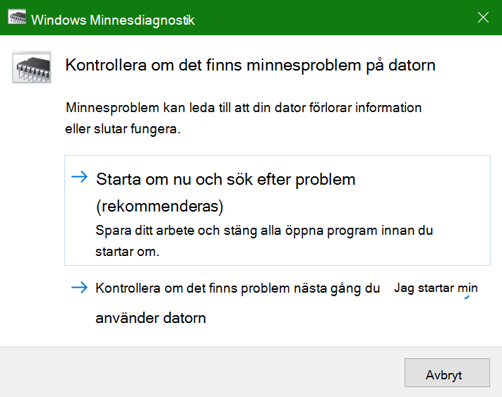

# Kör Windows Minnesdiagnostik i Windows 10Run Windows Memory Diagnostics in Windows 10

Om Windows och appar på din dator kraschar, fryser eller fungerar instabilt kan du ha problem med datorns minne ..If Windows and apps on your PC are crashing, freezing, or acting in an unstable manner, you may have a problem with the PC’s memory (RAM). Du kan köra Windows Minnesdiagnostik för att söka efter problem med datorns RAM-minne.You can run the Windows Memory Diagnostic to check for problems with the PC’s RAM.

Skriv minnesdiagnostik i sökrutan i **Aktivitetsfältet och** välj sedan **Windows minnesdiagnostik.**In the search box on your taskbar, type **memory diagnostic**, and then select **Windows Memory Diagnostic**. 

För att kunna köra diagnostiken måste datorn starta om.To run the diagnostic, the PC needs to restart. Du kan starta om direkt (spara ditt arbete och stäng öppna dokument och e-postmeddelanden först) eller schemalägga diagnostiken så att den körs automatiskt nästa gång datorn startar om:You have the option to restart immediately (please save your work and close open documents and e-mails first), or schedule the diagnostic to run automatically the next time the PC restarts:

När datorn startas om körs **windows minnesdiagnostikverktyget** automatiskt.When the PC restarts, the **Windows Memory Diagnostics Tool** will run automatically. Status och förlopp visas medan diagnostiken körs och du kan välja att avbryta diagnostiken genom att trycka på **ESC** på tangentbordet.Status and progress will be displayed as the diagnostics run, and you have the option of cancelling the diagnostics by hitting the **ESC** key on your keyboard.

När diagnostiken är klar startar Windows normalt.When the diagnostics are complete, Windows will start normally.
Omedelbart efter omstarten, när skrivbordet visas, visas  ett meddelande (bredvid ikonen för Åtgärdscenter i Aktivitetsfältet) som anger om några minnesfel hittades.Immediately after restart, when the Desktop appears, a notification will appear (next to the **Action Center** icon on the taskbar), to indicate whether any memory errors were found. Till exempel:For example:

Här är ikonen för Åtgärdscenter:Here's the Action Center icon:  

Och ett exempelmeddelande:And a sample notification: 

Om du missade meddelandet kan  du välja ikonen för Åtgärdscenter i Aktivitetsfältet för att visa **Åtgärdscenter** och se en rullningsbar lista med meddelanden.If you missed the notification, you can select the **Action Center** icon  on the taskbar to display the **Action Center** and see a scrollable list of notifications.

Om du vill granska detaljerad information **skriver** du händelsen i sökrutan i Aktivitetsfältet och väljer sedan **Loggboken**.To review detailed information, type **event** into the search box on your taskbar, and then select **Event Viewer**. I det **vänstra fönstret** i Loggboken går du till **Windows-loggar > System.**In the **Event Viewer**’s left-hand pane, navigate to **Windows Logs > System**. I fönstret till höger söker du nedåt i  listan medan du tittar på kolumnen Källa, tills du ser händelser med källvärdet **Minnesdiagnostics-Resultat.**In the right-hand pane, scan down the list while looking at the **Source** column, until you see events with Source value **MemoryDiagnostics-Results**. Markera varje sådan händelse och se resultatinformationen i rutan under **fliken** Allmänt under listan.Highlight each such event and see the result information in the box under the **General** tab below the list.
