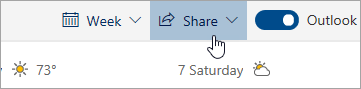

# Dela med Outlook på webbenSharing with Outlook on the web

1. Längst ned på sidan väljer du Kalender för att gå till Kalender.At the bottom of the page, select Calendar to go to Calendar.

2. Välj **Dela**i verktygsfältet i Kalendern och välj den kalender som du vill dela.In Calendar, on the toolbar at the top of the page, select **Share**, and choose the calendar you want to share. 

    

    **Du**kan inte dela kalendrar som ägs av andra.**Note**: You can't share calendars owned by other people.

3. Ange namnet eller e-postadressen till den person som du vill dela kalendern med.Enter the name or email address of the person you want to share your calendar with.

4. Välj hur du vill att personen ska använda kalendern:Choose how you want the person to use your calendar: 
    - **Kan visa när jag är upptagen**   låter dem se när du är upptagen men inte innehåller detaljer som händelsen plats.**Can view when I'm busy** lets them see when you're busy but doesn't include details like the event location. 
    - **Kan visa titlar och platser**   låter dem se när du är upptagen, samt titel och plats för händelser.**Can view titles and locations** lets them see when you're busy, as well as the title and location of events. 
    - **Kan visa alla detaljer**   kan de se alla detaljer om dina händelser.**Can view all details** lets them see all the details of your events. 
    - **Kan redigera**   kan de redigera din kalender.**Can edit** lets them edit your calendar. 
    - **Delegera**   kan de redigera din kalender och dela den med andra.**Delegate** lets them edit your calendar and share it with others.

5. Välj **Dela**.Select **Share**. Om du bestämmer dig för att inte dela kalendern just nu väljer du **Ta bort**.If you decide not to share your calendar right now, select **Remove**. 

**Anmärkningar**:**Notes**:  

- När du delar din kalender med någon som inte använder Outlook på webben, till exempel någon som använder Gmail, kan de bara acceptera inbjudan med ett Microsoft 365- eller Outlook.com-konto.When sharing your calendar with someone who's not using Outlook on the web, for example, someone using Gmail, they'll only be able to accept the invitation using a Microsoft 365 or an Outlook.com account. 

- ICS-kalendrar är skrivskyddade, så även om du beviljar redigeringsåtkomst till andra personer kan de inte redigera kalendern.ICS calendars are read-only, so even if you grant edit access to other people, they won't be able to edit your calendar. 

- Hur ofta din ICS-kalender synkroniseras beror på e-postleverantören för den person du har delat den med.How often your ICS calendar syncs depends on the email provider of the person you've shared it with. 

- Kalenderobjekt som är markerade som privata skyddas.Calendar items marked private are protected. De flesta personer som du delar din kalender med ser bara tiden för objekt som är markerade som privata, inte titeln, platsen eller annan information.Most people you share your calendar with see only the time of items marked private, not the title, location, or other details. Återkommande serier som markerats som privata visar också upprepningsmönstret.Recurring series marked as private will also show the recurrence pattern.
