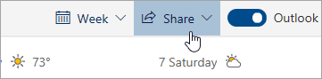

# Dela med Outlook på webbenSharing with Outlook on the web

Välj **Dela**i verktygsfältet högst upp på sidan i kalendern och välj den kalender som du vill dela.From your Calendar, on the toolbar at the top of the page, select **Share**, and choose the calendar you want to share.

    

**Du**kan inte dela kalendrar som ägs av andra.**Note**: You can't share calendars owned by other people.

- Ange namnet eller e-postadressen till den person som du vill dela kalendern med.Enter the name or email address of the person you want to share your calendar with.
- Välj hur du vill att personen ska använda kalendern:Choose how you want the person to use your calendar:
    - **Kan visa när jag är upptagen**   låter dem se när du är upptagen men inte innehåller detaljer som händelsen plats.**Can view when I'm busy** lets them see when you're busy but doesn't include details like the event location.
    - **Kan visa titlar och platser**   låter dem se när du är upptagen, samt titel och plats för händelser.**Can view titles and locations** lets them see when you're busy, as well as the title and location of events.
    - **Kan visa alla detaljer**   kan de se alla detaljer om dina händelser.**Can view all details** lets them see all the details of your events.
    - **Kan redigera**   kan de redigera din kalender.**Can edit** lets them edit your calendar.
    - **Delegera**   kan de redigera din kalender och dela den med andra.**Delegate** lets them edit your calendar and share it with others.
- Välj **Dela**.Select **Share**.
