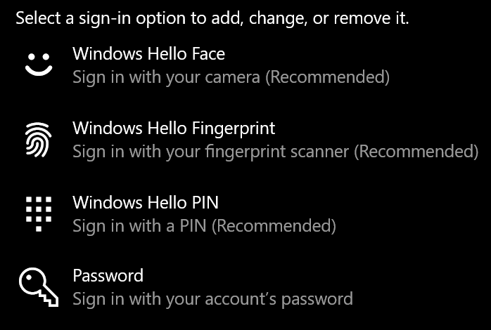
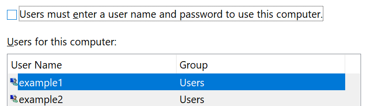

# Logga in i Windows 10 utan lösen ord

För att undvika att behöva ange ett lösen ord när du startar Windows rekommenderar vi att du använder ett av de säkra inloggnings alternativen för Windows Hello, till exempel en PIN-kod, en ansikts igenkänning eller ett finger avtryck, om det är tillgängligt. Om du vill inaktivera säker inloggning kan du läsa anvisningarna "logga in automatiskt på Windows 10" nedan.

**Säkra Windows Hello-alternativ till konto lösen ordet**

Gå till **inställningar > konton > inloggnings alternativ** (eller klicka [här](ms-settings:signinoptions?activationSource=GetHelp)). Tillgängliga inloggnings alternativ visas. Ett exempel:

Klicka eller tryck på ett av alternativen för att konfigurera det. Nästa gång du startar eller låser upp Windows kan du använda det nya alternativet i stället för ett lösen ord. 

**Logga in automatiskt i Windows 10**

**Obs!** automatisk inloggning är bekvämt, men introducerar en säkerhets risk, särskilt om din dator är tillgänglig för flera personer. 

1. Klicka eller tryck på **Start** -knappen i aktivitets fältet.

2. Skriv **netplwiz** och tryck på RETUR för att öppna fönstret användar konton.

3. I **användar konton**klickar du på det konto som du vill logga in automatiskt på när Windows startas.

4. Avmarkera kryss rutan "användare måste ange användar namn och lösen ord för att använda den här datorn".

    

5. Klicka på **OK**. Du uppmanas att ange och bekräfta lösen ordet för det konto som du har valt. Klicka på **OK** för att avsluta. Nästa gång Windows 10 startas loggar det automatiskt in på det konto som du har valt.
