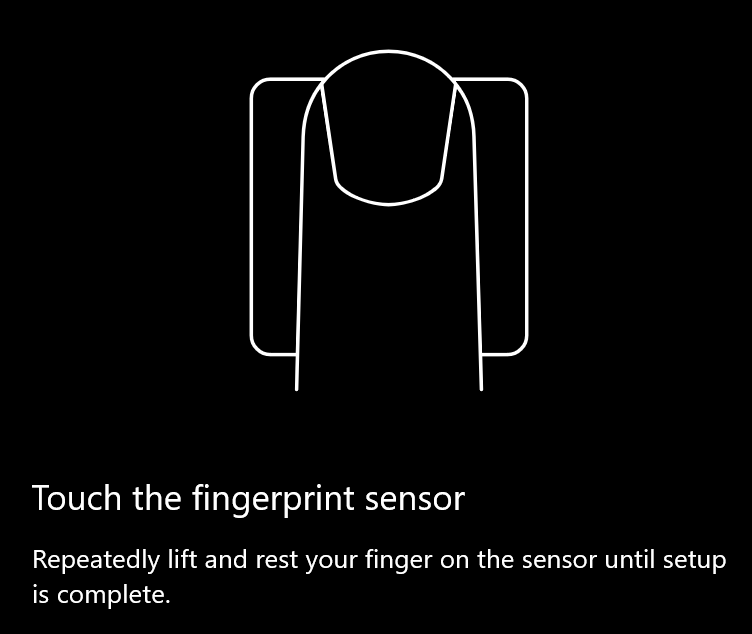
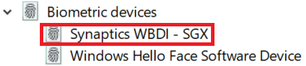

# Använda alternativ för fingeravtrycksupplåsning i Windows 10

**Aktivera Windows Hello-fingeravtryck**

Om du vill låsa upp Windows 10 med ditt fingeravtryck måste du konfigurera Windows Hello-fingeravtryck genom att lägga till (så att Windows lär sig att identifiera) minst ett finger. 

1. Gå till **Inställningar > Konton > Inloggningsalternativ (eller** klicka [här](ms-settings:signinoptions?activationSource=GetHelp)). Tillgängliga inloggningsalternativ visas. Till exempel:

    

2. Klicka eller tryck **på Windows Hello-fingeravtryck** och klicka **sedan på Konfigurera**. Klicka på Komma igång i installationsfönstret **för** Windows Hello. Fingeravtryckssensoren aktiveras och du uppmanas att placera fingret på sensorn:

   

3. Följ anvisningarna som ber dig att söka igenom fingret flera gånger. När det här är klart kan du välja att lägga till andra fingrar som du kanske vill använda för inloggning. Nästa gång du loggar in på Windows 10 kan du använda ditt fingeravtryck för att göra det.

**Windows Hello-fingeravtryck är inte tillgängligt som inloggningsalternativ**

Om Windows **Hello-fingeravtryck** inte visas som ett alternativ i Inloggningsalternativ betyder det att Windows inte känner till någon fingeravtrycksläsare/skanner som är ansluten till datorn eller att en systemprincip förhindrar dess användning (om din dator till exempel hanteras av din arbetsplats). Så här felsöker du: 

1. Välj **Start-knappen** i Aktivitetsfältet och sök efter **Enhetshanteraren.**

2. Klicka eller tryck för att öppna **Enhetshanteraren**.

3. I Enhetshanteraren expanderar du biometriska enheter genom att klicka på dess sparr.

   

4. Din fingeravtrycksskanner ska listas som en biometrisk enhet, till exempel Synaptics WBDI-skannern:

   

5. Om det inte visas någon fingeravtrycksskanner och skannern är integrerad i datorn går du till datortillverkarens webbplats. I avsnittet för teknisk support för din datormodell söker du efter en Windows 10-drivrutin för en skanner som du kan installera.

6. Om skannern är skild från datorn (ansluten via USB) går du till skannertillverkarens webbplats och söker efter och installerar drivrutinsprogramvaran för Windows 10 för den skannermodell du har.
