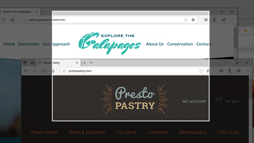
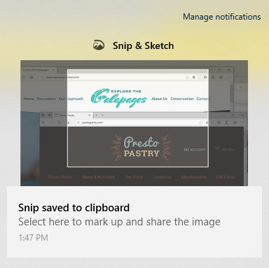

# Använda skärm bilden & skiss för att ta en bild av, märka och dela bilder

Skärm skissen kallas nu för **& skiss**. **Så här tar du ett skärm klipp**:

1. Tryck på **Windows-tangenten + Skift + S**. Skärmen visas mörkare och markören visar sig som ett kors. 

2. Välj en punkt på kanten av det område som du vill kopiera och Vänsterklicka på markören. 

3. Flytta markören för att markera det område du vill ta en bild av. Det område du fångar visas på skärmen.

   

Bilden du klipptes från sparas i Urklipp, som du kan klistra in i ett e-postmeddelande eller ett dokument. 

**Om du vill redigera eller visa bilden**: 

- Klicka på ikonen meddelanden längst till höger i aktivitets fältet. Klicka sedan på den bild du precis har skapat. Ditt klipp öppnas i &-programmet skiss.

   
