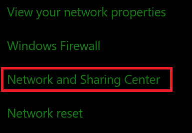
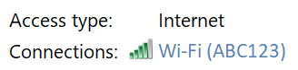
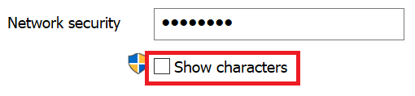

# Visa lösen ord för trådlöst nätverk i Windows 10

1. Kontrol lera att din Windows 10-dator är ansluten till Wi-Fi-nätverket.

2. Gå till **inställningar > nätverks & status för Internet >** eller klicka eller tryck [här](ms-settings:network?activationSource=GetHelp) för att låta oss ta dig dit.)

3. Klicka på **nätverks-och delnings Center**.

    

4. Bredvid **anslutningar**i **nätverks-och delnings Center**visas namnet på ditt trådlösa nätverk. Om ditt nätverk till exempel heter "ABC123" kan du se:

    

    Klicka på det trådlösa nätverks namnet för att öppna fönstret för WiFi-status. 

5. I fönstret Wi-Fi-status klickar du på **Egenskaper för trådlös kommunikation**, på fliken **säkerhet** och sedan på **Visa tecken**.

    

